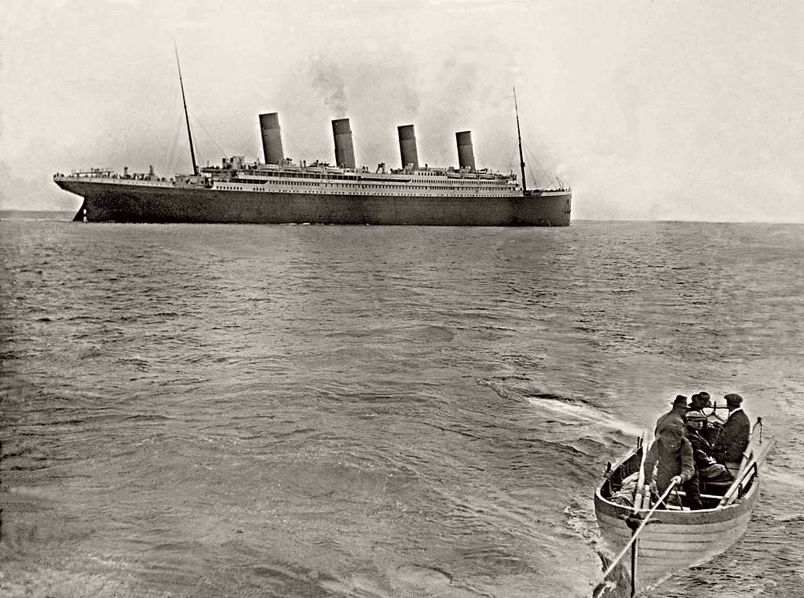

# PROYECTO MÓDULO 1 | TITANIC 

#### Estevo Arias García

### En este trabajo revelaremos datos sorprendentes sobre el Titanic

## Descubriremos...

- Datos reales de algunos pasajeros que no aparecen
- Qué se esconde tras los pasajeros con tickets 'LINE'
- Qué era el *Guarantee Group* de Thomas Andrews.

## Analizaremos

- Los curiosos prefijos de los tickets.
- La supervivencia por edad, sexo y clase.
- Crearemos un modelo predictivo.

## Referencias
1. Encyclopedia Titanica, (2024). William Henry Tornquist Disponible en: https://www.encyclopedia-titanica.org/titanic-survivor/william-henry-tornquist.html
2. Blog | Titanic Talks, (2024): Disponible en: https://milliehaworth.wixsite.com/website/post/titanic-connections-titanic-s-guarantee-group
3. Wikipedia, (2024). Pasajeros a bordo del RMS Titanic. Disponible en: https://es.wikipedia.org/wiki/Anexo:Pasajeros_a_bordo_del_RMS_Titanic
4. Encyclopedia Titanica, (2024). Disponible en: https://www.encyclopedia-titanica.org/
5. Bank of England. Inflation Calculator, (2024). Disponible en: https://www.bankofengland.co.uk/monetary-policy/inflation/inflation-calculator
6. Encyclopedia Titanica, (2024). Charlotte Wardle Cardeza. Disponible en: https://www.encyclopedia-titanica.org/titanic-survivor/charlotte-cardeza.html
7. Titanic. Birth of a Legend, (2024). The Guarantee group. Disponible en: https://atyeo.co.uk/titanic/pages/men-2.html
8. So'ton. Wikictionary. Disponible en: https://en.wiktionary.org/wiki/So%27ton#English
